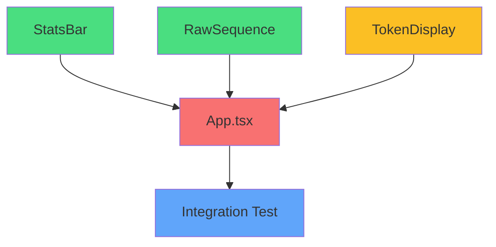

# 🗺️ Implementation Roadmap - LLM Tokenizer Visualizer

## Quick Status Overview

```
Backend:  ████████████████████░  90% Complete
Frontend: ░░░░░░░░░░░░░░░░░░░░   0% Complete
Docs:     ░░░░░░░░░░░░░░░░░░░░   0% Complete
Tests:    ████████░░░░░░░░░░░░  40% Complete (written but failing)
Overall:  ████████░░░░░░░░░░░░  40% Complete
```

---

## Phase-by-Phase Implementation Guide

### 🔴 Phase 1: Backend Stabilization (CRITICAL)

**Status**: In Progress  
**Blockers**: Test import errors  
**Time Estimate**: 1-2 hours

#### Tasks

1. **Fix Test Import Issues**

   ```bash
   # Option A: Add __init__.py files
   touch tokenizer-visualizer/backend/__init__.py
   touch tokenizer-visualizer/backend/tests/__init__.py
   
   # Option B: Configure pytest.ini
   # Create pytest.ini with pythonpath configuration
   
   # Option C: Use sys.path in tests
   # Add sys.path.append(os.path.dirname(os.path.dirname(__file__)))
   ```

2. **Run Full Test Suite**

   ```bash
   cd tokenizer-visualizer/backend
   pytest tests/ -v
   ```

   Expected output:

   ```
   tests/test_tokenizer.py::test_health PASSED
   tests/test_tokenizer.py::test_tokenize_hello_world PASSED
   tests/test_tokenizer.py::test_subword_detection PASSED
   tests/test_tokenizer.py::test_frequency_count PASSED
   tests/test_tokenizer.py::test_validation_errors PASSED
   
   ===== 5 passed in X.XXs =====
   ```

3. **Manual API Testing**

   ```bash
   # Start server
   uvicorn main:app --reload
   
   # Test health
   curl http://localhost:8000/health
   
   # Test models
   curl http://localhost:8000/models
   
   # Test tokenize
   curl -X POST http://localhost:8000/api/tokenize \
     -H "Content-Type: application/json" \
     -d '{"text": "Hello world", "model": "gpt2"}'
   ```

4. **Verify Token IDs**
   - "Hello world" → [15496, 995] ✓
   - "The quick brown fox" → verify against GPT-2
   - "tokenization" → verify subword split

**Exit Criteria**: All 5 tests pass, manual API calls return expected results

---

### 🟡 Phase 2: Frontend Foundation (HIGH PRIORITY)

**Status**: Not Started  
**Dependencies**: None (can start in parallel with Phase 1)  
**Time Estimate**: 3-4 hours

#### Task 2.1: Configuration Files

**Files to Create/Edit**:

1. **vite.config.ts**

   ```typescript
   import { defineConfig } from 'vite'
   import react from '@vitejs/plugin-react'
   import path from 'path'
   
   export default defineConfig({
     plugins: [react()],
     resolve: {
       alias: {
         '@': path.resolve(__dirname, './src'),
       },
     },
     server: {
       port: 5173,
       proxy: {
         '/api': {
           target: 'http://localhost:8000',
           changeOrigin: true,
         },
       },
     },
   })
   ```

2. **tailwind.config.ts**

   ```typescript
   import type { Config } from 'tailwindcss'
   
   export default {
     content: ['./index.html', './src/**/*.{js,ts,jsx,tsx}'],
     theme: {
       extend: {
         colors: {
           dark: {
             bg: '#0a0a14',
             card: '#0f0f1e',
             border: '#1a1a2e',
           },
           accent: {
             primary: '#7c6af5',
             secondary: '#9d8df7',
           },
         },
       },
     },
     plugins: [],
   } satisfies Config
   ```

3. **postcss.config.js** (NEW FILE)

   ```javascript
   export default {
     plugins: {
       tailwindcss: {},
       autoprefixer: {},
     },
   }
   ```

4. **index.html**

   ```html
   <!DOCTYPE html>
   <html lang="en">
     <head>
       <meta charset="UTF-8" />
       <meta name="viewport" content="width=device-width, initial-scale=1.0" />
       <title>LLM Tokenizer Visualizer</title>
     </head>
     <body>
       <div id="root"></div>
       <script type="module" src="/src/main.tsx"></script>
     </body>
   </html>
   ```

5. **src/main.tsx** (NEW FILE)

   ```typescript
   import React from 'react'
   import ReactDOM from 'react-dom/client'
   import App from './App'
   import './main.css'
   
   ReactDOM.createRoot(document.getElementById('root')!).render(
     <React.StrictMode>
       <App />
     </React.StrictMode>,
   )
   ```

6. **src/main.css** (NEW FILE)

   ```css
   @tailwind base;
   @tailwind components;
   @tailwind utilities;
   
   @layer base {
     body {
       @apply bg-dark-bg text-white;
     }
   }
   ```

#### Task 2.2: TypeScript Types

**File**: `src/types/index.ts`

```typescript
// Mirror all Pydantic models exactly

export interface TokenizeRequest {
  text: string
  model: 'gpt2' | 'bert-base-uncased'
  include_embeddings?: boolean
  include_bpe_steps?: boolean
}

export interface TokenInfo {
  text: string
  display: string
  id: number
  type: 'word' | 'subword' | 'punctuation' | 'special'
  position: number
  frequency: number
  color_index: number
}

export interface BPEStep {
  step: number
  description: string
  tokens: string[]
  merged_pair?: [string, string] | null
  result_token?: string | null
}

export interface EmbeddingInfo {
  token_id: number
  token_text: string
  vector: number[]
  full_dim: number
}

export interface TokenizeResponse {
  tokens: TokenInfo[]
  raw_ids: number[]
  vocab_size: number
  total_tokens: number
  unique_tokens: number
  reuse_rate: number
  bpe_steps?: BPEStep[] | null
  embeddings?: EmbeddingInfo[] | null
  model_used: string
  processing_time_ms: number
}

// UI-specific types
export type TabType = 'bpe' | 'tokens' | 'embeddings' | 'attention' | 'vocab' | 'raw'

export interface SampleText {
  name: string
  text: string
}
```

#### Task 2.3: API Layer

**File**: `src/api/tokenizer.ts`

```typescript
import axios from 'axios'
import type { TokenizeRequest, TokenizeResponse } from '@/types'

const api = axios.create({
  baseURL: '/api',
  headers: {
    'Content-Type': 'application/json',
  },
})

export const tokenizeText = async (
  request: TokenizeRequest
): Promise<TokenizeResponse> => {
  const response = await api.post<TokenizeResponse>('/tokenize', request)
  return response.data
}

export const getModels = async (): Promise<{ models: string[] }> => {
  const response = await api.get('/models')
  return response.data
}

export const healthCheck = async (): Promise<{ status: string }> => {
  const response = await api.get('/health')
  return response.data
}
```

#### Task 2.4: Zustand Store

**File**: `src/store/tokenizerStore.ts`

```typescript
import { create } from 'zustand'
import { tokenizeText } from '@/api/tokenizer'
import type { TokenizeResponse } from '@/types'

interface TokenizerState {
  // Input state
  input: string
  model: 'gpt2' | 'bert-base-uncased'
  
  // Response state
  result: TokenizeResponse | null
  loading: boolean
  error: string | null
  
  // UI state
  selectedTokenId: number | null
  activeTab: 'bpe' | 'tokens' | 'embeddings' | 'attention' | 'vocab' | 'raw'
  
  // Actions
  setInput: (value: string) => void
  setModel: (model: 'gpt2' | 'bert-base-uncased') => void
  setActiveTab: (tab: TokenizerState['activeTab']) => void
  selectToken: (id: number | null) => void
  tokenize: () => Promise<void>
  reset: () => void
}

export const useTokenizerStore = create<TokenizerState>((set, get) => ({
  // Initial state
  input: '',
  model: 'gpt2',
  result: null,
  loading: false,
  error: null,
  selectedTokenId: null,
  activeTab: 'tokens',
  
  // Actions
  setInput: (value) => set({ input: value }),
  
  setModel: (model) => set({ model }),
  
  setActiveTab: (tab) => set({ activeTab: tab }),
  
  selectToken: (id) => set({ selectedTokenId: id }),
  
  tokenize: async () => {
    const { input, model } = get()
    
    if (!input.trim()) {
      set({ error: 'Please enter some text to tokenize' })
      return
    }
    
    set({ loading: true, error: null })
    
    try {
      const result = await tokenizeText({
        text: input,
        model,
        include_embeddings: true,
        include_bpe_steps: true,
      })
      
      set({ result, loading: false })
    } catch (err) {
      const errorMessage = err instanceof Error ? err.message : 'Failed to tokenize text'
      set({ error: errorMessage, loading: false })
    }
  },
  
  reset: () => set({
    input: '',
    result: null,
    error: null,
    selectedTokenId: null,
  }),
}))
```

**Exit Criteria**:

- All config files created
- Types defined and match backend
- API layer implemented with error handling
- Zustand store implemented with all actions
- `npm install` runs successfully

---

### 🟢 Phase 3: Core UI Components (HIGH PRIORITY)

**Status**: Not Started  
**Dependencies**: Phase 2 complete  
**Time Estimate**: 4-6 hours

#### Component Implementation Order



#### Task 3.1: StatsBar Component

**File**: `src/components/StatsBar.tsx`

**Features**:

- Display total tokens, unique tokens, reuse rate
- Display vocab size, processing time
- Clean card layout with icons from lucide-react
- Responsive grid layout

**Complexity**: Low  
**Time**: 30 minutes

#### Task 3.2: RawSequence Component

**File**: `src/components/RawSequence.tsx`

**Features**:

- Display array of token IDs in monospace font
- Copy to clipboard button
- Formatted as JSON array
- Syntax highlighting (optional)

**Complexity**: Low  
**Time**: 30 minutes

#### Task 3.3: TokenDisplay Component

**File**: `src/components/TokenDisplay.tsx`

**Features**:

- Render each token as colored pill
- Consistent color by token ID (hash-based)
- Click to select/highlight all instances
- Hover tooltip with metadata
- Smooth CSS transitions
- Responsive wrapping

**Complexity**: Medium  
**Time**: 2 hours

**Key Implementation Details**:

```typescript
// Color generation from token ID
const getTokenColor = (tokenId: number): string => {
  const hue = (tokenId * 137.508) % 360 // Golden angle
  return `hsl(${hue}, 70%, 60%)`
}

// Tooltip content
interface TooltipData {
  text: string
  display: string
  id: number
  type: string
  position: number
  frequency: number
}
```

#### Task 3.4: Basic App Layout

**File**: `src/App.tsx`

**Features** (Phase 3 version - minimal):

- Header with title
- Text input area
- Model selector dropdown
- Tokenize button
- Loading state
- Error display
- StatsBar integration
- RawSequence integration
- TokenDisplay integration

**Complexity**: Medium  
**Time**: 2 hours

**Exit Criteria**:

- Can input text and click tokenize
- Loading state shows during API call
- Tokens display as colored pills
- Stats bar shows correct metrics
- Raw IDs display correctly
- Errors show user-friendly messages

---

### 🟠 Phase 4: Advanced Visualizations (MEDIUM PRIORITY)

**Status**: Not Started  
**Dependencies**: Phase 3 complete  
**Time Estimate**: 6-8 hours

#### Task 4.1: VocabTable Component

**File**: `src/components/VocabTable.tsx`

**Features**:

- Sortable columns (ID, Token, Type, Count, Frequency %)
- Type badges with distinct colors
- Inline frequency bars
- Row click highlights tokens in TokenDisplay
- Pagination for large vocabularies

**Complexity**: Medium  
**Time**: 2 hours

#### Task 4.2: EmbeddingChart Component

**File**: `src/components/EmbeddingChart.tsx`

**Features**:

- Recharts BarChart with grouped bars
- Top 6 tokens by frequency
- 16 bars per token (first 16 dimensions)
- Color-coded: positive (purple), negative (red)
- Tooltip with dimension values
- Note about full 768 dimensions

**Complexity**: Medium-High  
**Time**: 2-3 hours

**Key Implementation**:

```typescript
// Data transformation for Recharts
const chartData = embeddings.slice(0, 6).map((emb, idx) => ({
  token: emb.token_text,
  ...emb.vector.reduce((acc, val, dimIdx) => ({
    ...acc,
    [`dim${dimIdx}`]: val
  }), {})
}))
```

#### Task 4.3: AttentionHeatmap Component

**File**: `src/components/AttentionHeatmap.tsx`

**Features**:

- Custom grid (n×n cells, limit to first 8 tokens)
- Color scale: dark (#0a0a14) → bright (#7c6af5)
- Row/column labels with token text
- Click cell for tooltip
- Diagonal = 1.0 (self-attention)
- Clear note: "Simulated 1-head attention"

**Complexity**: High  
**Time**: 3-4 hours

**Attention Simulation**:

```typescript
// Simplified attention score calculation
const simulateAttention = (tokens: TokenInfo[]): number[][] => {
  const n = Math.min(tokens.length, 8)
  const attention: number[][] = []
  
  for (let i = 0; i < n; i++) {
    attention[i] = []
    for (let j = 0; j < n; j++) {
      if (i === j) {
        attention[i][j] = 1.0 // Self-attention
      } else {
        // Simulate based on distance and token similarity
        const distance = Math.abs(i - j)
        const similarity = tokens[i].id === tokens[j].id ? 0.3 : 0
        attention[i][j] = Math.max(0.1, (1 / distance) * 0.5 + similarity)
      }
    }
  }
  
  return attention
}
```

**Exit Criteria**:

- VocabTable sorts correctly
- EmbeddingChart displays bars for top tokens
- AttentionHeatmap shows color-coded grid
- All components integrate with App.tsx tabs

---

### 🔵 Phase 5: BPE Animation (MEDIUM PRIORITY)

**Status**: Not Started  
**Dependencies**: Phase 3 complete  
**Time Estimate**: 4-5 hours

#### Task 5.1: BPEAnimation Component

**File**: `src/components/BPEAnimation.tsx`

**Features**:

- Play/Pause/Step controls
- Speed slider (0.5x to 3x)
- Highlight merge pairs in yellow
- Show result token in purple
- Step counter and description
- Timeline scrubber
- Auto-play option

**Complexity**: High  
**Time**: 4-5 hours

**State Management**:

```typescript
interface AnimationState {
  currentStep: number
  isPlaying: boolean
  speed: number // 0.5 to 3.0
  intervalId: number | null
}
```

**Key Features**:

1. Step-by-step display of BPE merges
2. Visual highlighting of pairs being merged
3. Smooth transitions between steps
4. Timeline scrubber for jumping to specific steps
5. Speed control for animation

**Exit Criteria**:

- Animation plays through all BPE steps
- Controls work (play, pause, step, speed)
- Visual highlighting is clear
- Timeline scrubber is functional

---

### 🟣 Phase 6: Full App Integration (HIGH PRIORITY)

**Status**: Not Started  
**Dependencies**: Phases 3, 4, 5 complete  
**Time Estimate**: 2-3 hours

#### Task 6.1: Complete App.tsx

**Features to Add**:

- Tab navigation (BPE Steps, Tokens, Embeddings, Attention, Vocab, Raw)
- Sample text presets (Story, Code, RAG Document)
- Model switcher (GPT-2 ↔ BERT)
- Dark theme polish
- Loading skeletons
- Error toast notifications
- Responsive layout

**Tab Structure**:

```typescript
const tabs = [
  { id: 'bpe', label: 'BPE Steps', component: BPEAnimation },
  { id: 'tokens', label: 'Token Visualization', component: TokenDisplay },
  { id: 'embeddings', label: 'Embeddings', component: EmbeddingChart },
  { id: 'attention', label: 'Attention', component: AttentionHeatmap },
  { id: 'vocab', label: 'Vocabulary', component: VocabTable },
  { id: 'raw', label: 'Raw Sequence', component: RawSequence },
]
```

**Sample Texts**:

```typescript
const sampleTexts = [
  {
    name: 'Story',
    text: 'The quick brown fox jumps over the lazy dog. This pangram contains every letter of the alphabet.',
  },
  {
    name: 'Code',
    text: 'function tokenize(text) { return text.split(" ").map(word => word.toLowerCase()); }',
  },
  {
    name: 'RAG Document',
    text: 'Large Language Models use tokenization to convert text into numerical representations. The most common algorithm is Byte Pair Encoding (BPE), which iteratively merges the most frequent character pairs.',
  },
]
```

**Exit Criteria**:

- All tabs render correctly
- Tab switching works smoothly
- Sample texts load on click
- Model switching triggers re-tokenization
- UI is polished and responsive

---

### 🟤 Phase 7: Testing & Integration (HIGH PRIORITY)

**Status**: Not Started  
**Dependencies**: Phase 6 complete  
**Time Estimate**: 2-3 hours

#### Task 7.1: Install Dependencies

```bash
cd tokenizer-visualizer/frontend
npm install
```

Expected output: No errors, all dependencies installed

#### Task 7.2: Start Backend

```bash
cd tokenizer-visualizer/backend
uvicorn main:app --reload
```

Expected output:

```
INFO:     Uvicorn running on http://127.0.0.1:8000
INFO:     Application startup complete.
Models preloaded into memory on startup.
```

#### Task 7.3: Start Frontend

```bash
cd tokenizer-visualizer/frontend
npm run dev
```

Expected output:

```
VITE v5.2.0  ready in XXX ms

➜  Local:   http://localhost:5173/
➜  Network: use --host to expose
```

#### Task 7.4: Integration Tests

**Test Cases**:

1. **Basic Tokenization**
   - Input: "Hello world"
   - Expected: [15496, 995]
   - Verify: Token IDs match, display text is correct

2. **Subword Detection**
   - Input: "tokenization"
   - Expected: First token type = "word", second = "subword"
   - Verify: Types are correct

3. **Frequency Counting**
   - Input: "cat cat dog"
   - Expected: "cat" frequency = 2, "dog" frequency = 1
   - Verify: Frequencies are correct

4. **Embeddings**
   - Input: "Hello world"
   - Expected: 2 embedding vectors, each with 16 dimensions
   - Verify: Vectors are non-zero, chart displays correctly

5. **BPE Animation**
   - Input: "tokenization"
   - Expected: Multiple BPE steps showing merges
   - Verify: Animation plays, steps are clear

6. **Model Switching**
   - Switch from GPT-2 to BERT
   - Input: "Hello world"
   - Expected: Different token IDs (BERT uses different vocab)
   - Verify: Tokens change, vocab size changes

7. **Error Handling**
   - Input: "" (empty string)
   - Expected: Error message displayed
   - Verify: User-friendly error, no crash

8. **Performance**
   - Input: 500-word text
   - Expected: Response < 200ms
   - Verify: Check X-Process-Time header

**Exit Criteria**:

- All 8 test cases pass
- No console errors
- Performance meets targets
- UI is responsive and smooth

---

### ⚪ Phase 8: Documentation (MEDIUM PRIORITY)

**Status**: Not Started  
**Dependencies**: Phase 7 complete  
**Time Estimate**: 2-3 hours

#### Task 8.1: README.md

**Sections to Include**:

1. **Project Overview**
   - What it does
   - Why it's useful
   - Key features

2. **Architecture Diagram**

   ```mermaid
   graph LR
       A[User] --> B[React Frontend]
       B --> C[FastAPI Backend]
       C --> D[HuggingFace Models]
       D --> C
       C --> B
       B --> A
   ```

3. **Setup Instructions**
   - Prerequisites (Python 3.11+, Node 18+)
   - Backend setup
   - Frontend setup
   - Running the application

4. **API Documentation**
   - `/health` endpoint
   - `/models` endpoint
   - `/api/tokenize` endpoint with curl examples

5. **How It Works**
   - 4-step explanation: Input → Tokenization → Embeddings → Visualization

6. **Known Limitations**
   - Attention is simulated
   - Embeddings are layer-0 only
   - Text length limited to 2000 chars

7. **Troubleshooting**
   - Common issues and solutions

8. **Screenshots**
   - Placeholder for screenshots

**Exit Criteria**:

- README is comprehensive
- Setup instructions are clear
- API documentation is complete
- Known limitations are documented

---

## Critical Path Summary

```
Phase 1 (Backend Fix) → Phase 2 (Frontend Foundation) → Phase 3 (Core UI)
                                                              ↓
                                                         Phase 6 (Integration)
                                                              ↓
                                                         Phase 7 (Testing)
                                                              ↓
                                                         Phase 8 (Docs)

Phase 4 (Advanced Viz) ──────────────────────────────────────┘
Phase 5 (BPE Animation) ─────────────────────────────────────┘
```

**Parallel Work Possible**:

- Phase 1 and Phase 2 can be done in parallel
- Phase 4 and Phase 5 can be done in parallel after Phase 3

---

## Risk Mitigation Strategies

### High-Risk Items

1. **BPE Animation Complexity**
   - **Risk**: Most complex component, could take longer than estimated
   - **Mitigation**: Build incrementally, start with static display
   - **Fallback**: Skip animation, show static steps only

2. **Attention Heatmap Performance**
   - **Risk**: Large matrices could be slow to render
   - **Mitigation**: Limit to first 8 tokens, use CSS transforms
   - **Fallback**: Show simplified view or table instead

3. **Type Mismatches**
   - **Risk**: TypeScript types might not match Pydantic exactly
   - **Mitigation**: Careful manual verification, use Zod for runtime validation
   - **Fallback**: Use `any` temporarily (not ideal but unblocks progress)

### Medium-Risk Items

1. **CORS Issues**
   - **Risk**: Frontend/backend on different ports
   - **Mitigation**: Vite proxy configured, CORS headers set
   - **Fallback**: Run both on same port with static file serving

2. **Model Download Time**
   - **Risk**: First run downloads ~500MB
   - **Mitigation**: Document in README, show progress
   - **Fallback**: Provide pre-download script

---

## Success Metrics

### MVP Success (Must Have)

- [ ] Backend tokenizes text correctly
- [ ] Frontend displays colored token pills
- [ ] Token metadata shows on hover
- [ ] Stats bar displays metrics
- [ ] Raw token IDs display
- [ ] "Hello world" → [15496, 995] verified end-to-end

### Full Feature Success (Should Have)

- [ ] BPE animation works
- [ ] Embedding chart displays
- [ ] Attention heatmap displays
- [ ] Vocabulary table is sortable
- [ ] Tab navigation works
- [ ] Sample texts load
- [ ] Model switching works

### Polish Success (Nice to Have)

- [ ] Loading skeletons
- [ ] Error toasts
- [ ] Copy to clipboard
- [ ] Export as JSON
- [ ] Keyboard shortcuts
- [ ] Responsive design

---

## Timeline Estimate

| Phase | Time | Dependencies | Can Start |
|-------|------|--------------|-----------|
| Phase 1 | 1-2h | None | Immediately |
| Phase 2 | 3-4h | None | Immediately |
| Phase 3 | 4-6h | Phase 2 | After Phase 2 |
| Phase 4 | 6-8h | Phase 3 | After Phase 3 |
| Phase 5 | 4-5h | Phase 3 | After Phase 3 |
| Phase 6 | 2-3h | Phases 3,4,5 | After all components |
| Phase 7 | 2-3h | Phase 6 | After integration |
| Phase 8 | 2-3h | Phase 7 | After testing |

**Total Sequential**: ~25-34 hours  
**Total with Parallelization**: ~20-28 hours

---

## Next Immediate Actions

1. ✅ Create architecture document
2. ✅ Create implementation roadmap (this document)
3. ⏳ Fix backend test imports
4. ⏳ Create frontend config files
5. ⏳ Implement TypeScript types
6. ⏳ Implement API layer
7. ⏳ Implement Zustand store

**Ready to proceed with implementation!** 🚀
