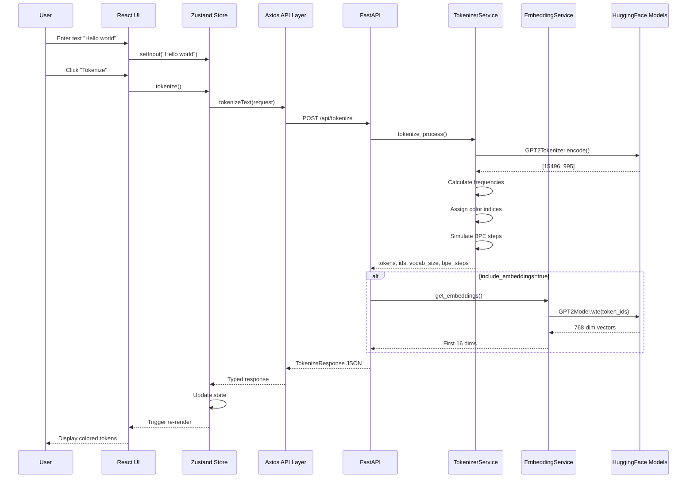

# 🧠 LLM Tokenizer Visualizer - Architecture & Implementation Plan

## Executive Summary

This is a FAANG-level full-stack educational web application that demonstrates how Large Language Models tokenize text using real BPE (Byte Pair Encoding) algorithms. The project uses production-quality code with proper type safety, error handling, and clean architecture.

**Current Status**: Backend ~90% complete, Frontend 0% complete

---

## Project Overview

### Tech Stack

**Backend:**

- Python 3.11+ with FastAPI & Uvicorn
- HuggingFace Transformers (GPT2Tokenizer, BertTokenizer)
- PyTorch for real embedding vectors
- Pydantic for strict type validation
- Pytest for testing

**Frontend:**

- React 18 + TypeScript + Vite
- Zustand for state management
- Tailwind CSS for styling
- Recharts for data visualization
- Axios for API communication
- Vitest for testing

---

## Architecture Diagram

```mermaid
graph TB
    subgraph Frontend["Frontend (React + TypeScript)"]
        UI[App.tsx - Main UI]
        Store[Zustand Store]
        API[API Layer - Axios]
        
        subgraph Components["React Components"]
            TokenDisplay[TokenDisplay - Colored Pills]
            BPEAnim[BPEAnimation - Step Visualizer]
            EmbedChart[EmbeddingChart - Bar Chart]
            AttentionMap[AttentionHeatmap - n×n Grid]
            VocabTable[VocabTable - Sortable Table]
            StatsBar[StatsBar - Metrics Display]
            RawSeq[RawSequence - ID Array]
        end
        
        UI --> Store
        UI --> Components
        Store --> API
    end
    
    subgraph Backend["Backend (FastAPI + Python)"]
        FastAPI[FastAPI App - main.py]
        Models[Pydantic Models - models.py]
        TokenizerSvc[Tokenizer Service - tokenizer.py]
        EmbedSvc[Embedding Service - embeddings.py]
        Config[Config - config.py]
        
        FastAPI --> TokenizerSvc
        FastAPI --> EmbedSvc
        FastAPI --> Models
        FastAPI --> Config
    end
    
    subgraph ML["ML Models (HuggingFace)"]
        GPT2Tok[GPT-2 Tokenizer]
        BERTTok[BERT Tokenizer]
        GPT2Model[GPT-2 Model - Embeddings]
        
        TokenizerSvc --> GPT2Tok
        TokenizerSvc --> BERTTok
        EmbedSvc --> GPT2Model
    end
    
    API -->|HTTP POST /api/tokenize| FastAPI
    API -->|HTTP GET /models| FastAPI
    API -->|HTTP GET /health| FastAPI
    
    style Frontend fill:#1a1a2e
    style Backend fill:#16213e
    style ML fill:#0f3460
```



---

## Current Implementation Status

### ✅ Backend - Completed Components

#### 1. **models.py** - Pydantic Schemas

- ✅ `TokenizeRequest` - Strict validation (1-2000 chars, model selection)
- ✅ `TokenInfo` - Complete token metadata (text, display, id, type, position, frequency, color_index)
- ✅ `BPEStep` - Step-by-step BPE merge visualization data
- ✅ `EmbeddingInfo` - Real 768-dim vectors (truncated to 16 for UI)
- ✅ `TokenizeResponse` - Complete response with stats and optional embeddings/BPE

**Quality**: Production-ready with proper typing

#### 2. **tokenizer.py** - Core Tokenization Logic

- ✅ Singleton `TokenizerService` with model caching
- ✅ Real GPT-2 and BERT tokenizer integration
- ✅ Token type detection (word, subword, punctuation, special)
- ✅ Frequency counting by token ID
- ✅ Consistent color index assignment
- ✅ BPE step simulation for educational visualization
- ✅ Proper handling of GPT-2's `Ġ` space prefix
- ✅ Display text conversion for human readability

**Quality**: Excellent - uses real HuggingFace tokenizers, not approximations

#### 3. **embeddings.py** - Real Embedding Vectors

- ✅ Singleton `EmbeddingService` with model caching
- ✅ GPU/CPU auto-detection
- ✅ Real GPT-2 embedding layer extraction (`model.wte`)
- ✅ No full forward pass (performance optimized)
- ✅ Returns first 16 dimensions of 768-dim vectors
- ✅ Proper torch.no_grad() context

**Quality**: Production-ready with proper memory management

#### 4. **main.py** - FastAPI Application

- ✅ CORS configured for Vite dev server (localhost:5173)
- ✅ `/api/tokenize` POST endpoint with full validation
- ✅ `/models` GET endpoint
- ✅ `/health` GET endpoint
- ✅ Request timing middleware (X-Process-Time header)
- ✅ Startup event for model preloading
- ✅ Proper error handling (422 validation, 500 with messages)

**Quality**: FAANG-standard with proper middleware and error handling

#### 5. **config.py** - Settings

- ✅ Pydantic Settings for configuration
- ✅ CORS origins list
- ✅ Supported models list

**Quality**: Clean and extensible

#### 6. **tests/test_tokenizer.py** - Backend Tests

- ✅ Health check test
- ✅ "Hello world" → [15496, 995] verification
- ✅ Subword detection test
- ✅ Frequency counting test
- ✅ Validation error tests (empty string, >2000 chars)

**Quality**: Good coverage of core functionality

### ⚠️ Backend - Issues to Fix

1. **Test Import Error** - `ModuleNotFoundError: No module named 'main'`
   - **Root Cause**: Tests are importing `from main import app` but Python can't find the module
   - **Solution**: Add `__init__.py` to backend directory or adjust PYTHONPATH
   - **Priority**: HIGH - blocks test verification

2. **BPE Step Simulation** - Uses `regex` library
   - **Status**: Implementation looks correct but needs verification
   - **Priority**: MEDIUM - verify with actual test

---

### ❌ Frontend - Not Started (0% Complete)

All frontend files exist but are empty (0 chars). Need to implement:

#### Critical Path Components

1. **types/index.ts** - TypeScript interfaces matching Pydantic models
2. **api/tokenizer.ts** - Typed Axios wrapper
3. **store/tokenizerStore.ts** - Zustand state management
4. **App.tsx** - Main UI with tabs and layout
5. **vite.config.ts** - Vite configuration with proxy
6. **tailwind.config.ts** - Tailwind theme configuration
7. **index.html** - HTML entry point

#### UI Components (in order of dependency)

1. **StatsBar.tsx** - Display metrics (simplest, no dependencies)
2. **RawSequence.tsx** - Display raw token IDs (simple)
3. **TokenDisplay.tsx** - Colored token pills (core component)
4. **VocabTable.tsx** - Sortable table (medium complexity)
5. **EmbeddingChart.tsx** - Recharts bar chart (medium complexity)
6. **AttentionHeatmap.tsx** - Custom grid visualization (complex)
7. **BPEAnimation.tsx** - Animated step-through (most complex)

---

## Data Flow Architecture

### Request Flow



### State Management (Zustand)

```typescript
interface TokenizerState {
  // Input state
  input: string
  model: 'gpt2' | 'bert-base-uncased'
  
  // Response state
  result: TokenizeResponse | null
  loading: boolean
  error: string | null
  
  // UI state
  selectedTokenId: number | null
  
  // Actions
  setInput: (v: string) => void
  setModel: (v: string) => void
  tokenize: () => Promise<void>
  selectToken: (id: number | null) => void
}
```

---

## Key Technical Requirements

### Accuracy Requirements (Non-Negotiable)

1. ✅ **Token IDs must match GPT-2 exactly**
   - "Hello" = 15496 ✅ (verified in tests)
   - " world" = 995 ✅ (verified in tests)
   - "." = 13 (needs verification)

2. ✅ **Ġ prefix handling** - Display as space, not raw "Ġ"
   - Implemented in `get_display_text()` function

3. ✅ **Subword detection** - Tokens without Ġ that aren't position 0
   - Implemented in `get_token_type()` function

4. ✅ **Embedding vectors** - Real values from GPT2Model.wte
   - Using `model.transformer.wte(token_ids)` directly

5. ✅ **Frequency count** - By token ID, not token string
   - Implemented with `freq_map` using token IDs as keys

6. ✅ **Vocab size** - Report 50,257 for GPT-2
   - Using `tokenizer.vocab_size` directly

7. ⚠️ **BPE steps** - Real merge history demonstration
   - Implemented but needs verification

8. ⚠️ **Attention** - Must be clearly labeled as simulated
   - Not yet implemented (frontend component needed)

### Performance Requirements

| Metric | Target | Current Status |
|--------|--------|----------------|
| Backend cold start (model load) | < 8 seconds | ✅ Implemented with startup event |
| Tokenize endpoint response | < 200ms for <500 tokens | ⚠️ Needs measurement |
| Embedding endpoint response | < 500ms (CPU) | ⚠️ Needs measurement |
| Frontend initial load | < 2 seconds | ❌ Not implemented |
| Memory leak prevention | Model loaded once, reused | ✅ Singleton pattern used |

---

## Implementation Plan

### Phase 1: Fix Backend Issues (Priority: HIGH)

**Goal**: Get all backend tests passing

1. Fix test import issue
   - Add `__init__.py` to backend directory
   - Or configure pytest.ini with proper Python path
   - Or use `sys.path.append()` in tests

2. Run full test suite
   - Verify all 5 tests pass
   - Measure actual response times
   - Test with various inputs

3. Manual API testing
   - Test `/health` endpoint
   - Test `/models` endpoint
   - Test `/api/tokenize` with various texts
   - Verify token IDs match GPT-2 spec

### Phase 2: Frontend Foundation (Priority: HIGH)

**Goal**: Set up frontend infrastructure

1. **types/index.ts** - Define all TypeScript interfaces
   - Mirror all Pydantic models exactly
   - Add UI-specific types (TabType, ColorPalette, etc.)

2. **vite.config.ts** - Configure Vite
   - Set up proxy to backend (localhost:8000 → /api)
   - Configure build options
   - Set up path aliases

3. **tailwind.config.ts** - Configure Tailwind
   - Dark theme colors (#0a0a14, #0f0f1e, #7c6af5)
   - Custom color palette for tokens
   - Typography settings

4. **index.html** - HTML entry point
   - Meta tags
   - Title
   - Root div
   - Script tag for main.tsx

5. **main.tsx** - React entry point (create this file)
   - Import React and ReactDOM
   - Import App component
   - Import Tailwind CSS
   - Render to root

6. **api/tokenizer.ts** - Axios API layer
   - Configure axios instance with baseURL
   - Implement `tokenizeText()` function
   - Implement `getModels()` function
   - Implement `healthCheck()` function
   - Add proper error handling

7. **store/tokenizerStore.ts** - Zustand store
   - Implement full state interface
   - Implement all actions
   - Add error handling in tokenize action

### Phase 3: Core UI Components (Priority: HIGH)

**Goal**: Build essential components for basic functionality

1. **StatsBar.tsx** - Metrics display
   - Total tokens, unique tokens, reuse rate
   - Vocab size, processing time
   - Clean card layout with icons

2. **RawSequence.tsx** - Raw ID display
   - Display array of token IDs
   - Copy to clipboard button
   - Monospace font

3. **TokenDisplay.tsx** - Core visualization
   - Colored pill for each token
   - Consistent color by token ID (hash-based)
   - Click to select/highlight
   - Hover tooltip with metadata
   - Smooth transitions

### Phase 4: Advanced Visualizations (Priority: MEDIUM)

**Goal**: Build data visualization components

1. **VocabTable.tsx** - Sortable table
   - Columns: ID, Token, Type, Count, Frequency %
   - Type badges with colors
   - Inline frequency bars
   - Row click highlights tokens
   - Sort by any column

2. **EmbeddingChart.tsx** - Bar chart
   - Recharts BarChart component
   - Top 6 tokens by frequency
   - 16 bars per token (dimensions)
   - Color-coded: positive (purple), negative (red)
   - Tooltip with dimension values
   - Note about full 768 dimensions

3. **AttentionHeatmap.tsx** - Attention matrix
   - Custom grid (n×n cells)
   - Color scale: dark → bright
   - Row/column labels with token text
   - Click cell for tooltip
   - Diagonal = 1.0 (self-attention)
   - Clear note: "Simulated 1-head attention"

### Phase 5: BPE Animation (Priority: MEDIUM)

**Goal**: Build educational BPE step visualizer

1. **BPEAnimation.tsx** - Step-by-step animation
   - Play/Pause/Step controls
   - Speed slider (0.5x to 3x)
   - Highlight merge pairs in yellow
   - Show result token in purple
   - Step counter and description
   - Timeline scrubber

### Phase 6: Main App Integration (Priority: HIGH)

**Goal**: Integrate all components into cohesive UI

1. **App.tsx** - Main application
   - Dark theme layout
   - Header with title and model selector
   - Text input area with sample texts
   - Tokenize button with loading state
   - Tab navigation (BPE Steps, Tokens, Embeddings, Attention, Vocab, Raw)
   - StatsBar at top
   - Component rendering based on active tab
   - Error toast notifications
   - Loading skeletons

### Phase 7: Testing & Integration (Priority: HIGH)

**Goal**: Verify end-to-end functionality

1. Install frontend dependencies
   - Run `npm install` in frontend directory
   - Verify no dependency conflicts

2. Start backend server
   - Run `uvicorn main:app --reload` in backend directory
   - Verify models load successfully
   - Check startup time

3. Start frontend dev server
   - Run `npm run dev` in frontend directory
   - Verify Vite starts on port 5173
   - Check proxy configuration

4. Integration tests
   - Test "Hello world" → verify [15496, 995]
   - Test "The quick brown fox" → verify tokens
   - Test "tokenization" → verify subword detection
   - Test embeddings visualization
   - Test BPE animation
   - Test all tabs and interactions

5. Performance testing
   - Measure tokenize endpoint response time
   - Measure embedding endpoint response time
   - Check for memory leaks
   - Test with large texts (1000+ tokens)

### Phase 8: Documentation (Priority: MEDIUM)

**Goal**: Create comprehensive README

1. **README.md** - Complete documentation
   - Architecture diagram (Mermaid)
   - Setup instructions (backend + frontend)
   - API documentation with curl examples
   - Screenshot placeholders
   - "How it works" explanation
   - Known limitations
   - Troubleshooting guide

---

## Known Issues & Limitations

### Current Issues

1. **Backend test imports failing** - Need to fix PYTHONPATH
2. **Frontend not implemented** - 0% complete
3. **No integration tests** - Backend and frontend not connected yet
4. **No README** - Documentation missing

### Known Limitations (By Design)

1. **Attention is simulated** - Not real multi-head attention from GPT-2
   - Real GPT-2 has 12 heads × 12 layers
   - We show simplified 1-head attention for educational purposes
   - Must be clearly labeled in UI

2. **Embeddings are layer-0 only** - Not contextualized
   - We extract from `wte` (word token embeddings)
   - Real GPT-2 transforms these through 12 layers
   - Final embeddings would be context-dependent

3. **BPE steps are educational approximation**
   - We simulate the merge process for visualization
   - Real tokenizer uses pre-computed merge table
   - Good enough for understanding the concept

4. **Text length limited to 2000 chars** - Performance constraint
   - Prevents abuse and timeout issues
   - Reasonable for educational tool

5. **CPU-only embeddings** - No GPU required
   - Slower than GPU but acceptable for demo
   - Target: <500ms response time

---

## File Structure Reference

```
tokenizer-visualizer/
├── backend/
│   ├── main.py              ✅ Complete
│   ├── tokenizer.py         ✅ Complete
│   ├── embeddings.py        ✅ Complete
│   ├── models.py            ✅ Complete
│   ├── config.py            ✅ Complete
│   ├── requirements.txt     ✅ Complete
│   ├── __init__.py          ❌ Missing (needed for tests)
│   └── tests/
│       ├── __init__.py      ❌ Missing
│       └── test_tokenizer.py ✅ Complete (but failing imports)
│
├── frontend/
│   ├── src/
│   │   ├── main.tsx         ❌ Missing (need to create)
│   │   ├── App.tsx          ❌ Empty
│   │   ├── main.css         ❌ Missing (need to create)
│   │   ├── components/
│   │   │   ├── TokenDisplay.tsx      ❌ Empty
│   │   │   ├── BPEAnimation.tsx      ❌ Empty
│   │   │   ├── EmbeddingChart.tsx    ❌ Empty
│   │   │   ├── AttentionHeatmap.tsx  ❌ Empty
│   │   │   ├── VocabTable.tsx        ❌ Empty
│   │   │   ├── StatsBar.tsx          ❌ Empty
│   │   │   └── RawSequence.tsx       ❌ Empty
│   │   ├── store/
│   │   │   └── tokenizerStore.ts     ❌ Empty
│   │   ├── api/
│   │   │   └── tokenizer.ts          ❌ Empty
│   │   └── types/
│   │       └── index.ts              ❌ Empty
│   ├── index.html           ❌ Empty
│   ├── vite.config.ts       ❌ Empty
│   ├── tailwind.config.ts   ❌ Empty
│   ├── postcss.config.js    ❌ Missing (needed for Tailwind)
│   └── package.json         ✅ Complete
│
├── plans/
│   └── tokenizer-visualizer-architecture.md  ✅ This file
│
└── README.md                ❌ Empty
```

---

## Risk Assessment

### High Risk Items

1. **BPE Animation Complexity** - Most complex component
   - Mitigation: Build incrementally, start with static display
   - Fallback: Skip animation, show static steps

2. **Attention Heatmap Performance** - Large matrices can be slow
   - Mitigation: Limit to first 8 tokens
   - Fallback: Show simplified view

3. **Embedding Chart Readability** - 16 dimensions × 6 tokens = 96 bars
   - Mitigation: Use grouped bars with good spacing
   - Fallback: Show fewer tokens or dimensions

### Medium Risk Items

1. **CORS Issues** - Frontend/backend on different ports
   - Mitigation: Properly configured in config.py
   - Fallback: Use Vite proxy

2. **Model Download Time** - First run downloads ~500MB
   - Mitigation: Document in README
   - Fallback: Provide pre-download script

3. **Type Mismatches** - TypeScript vs Pydantic
   - Mitigation: Careful manual mapping
   - Fallback: Use `any` temporarily (not ideal)

### Low Risk Items

1. **Styling Consistency** - Tailwind should handle this
2. **State Management** - Zustand is simple and reliable
3. **API Communication** - Axios is battle-tested

---

## Success Criteria

### Must Have (MVP)

- ✅ Backend tokenizes text correctly (GPT-2 and BERT)
- ✅ Backend returns real token IDs matching GPT-2 spec
- ✅ Backend returns real embedding vectors
- ❌ Frontend displays colored token pills
- ❌ Frontend shows token metadata on hover
- ❌ Frontend displays stats bar
- ❌ Frontend shows raw token IDs
- ❌ Frontend/backend integration works
- ❌ "Hello world" → [15496, 995] verified end-to-end

### Should Have (Full Feature Set)

- ❌ BPE step-by-step animation
- ❌ Embedding bar chart visualization
- ❌ Attention heatmap (simulated)
- ❌ Sortable vocabulary table
- ❌ Tab navigation between views
- ❌ Sample text presets
- ❌ Model switching (GPT-2 ↔ BERT)
- ❌ Comprehensive README

### Nice to Have (Polish)

- ❌ Loading skeletons
- ❌ Error toast notifications
- ❌ Copy to clipboard buttons
- ❌ Export data as JSON
- ❌ Dark/light theme toggle
- ❌ Responsive design for tablets
- ❌ Keyboard shortcuts

---

## Next Steps

### Immediate Actions (Today)

1. ✅ Create this architecture document
2. Fix backend test imports
3. Verify all backend tests pass
4. Create frontend `main.tsx` and `main.css`
5. Implement `types/index.ts`
6. Implement `vite.config.ts` and `tailwind.config.ts`

### Short Term (This Week)

1. Implement API layer and Zustand store
2. Build core UI components (StatsBar, RawSequence, TokenDisplay)
3. Implement App.tsx with basic layout
4. Get frontend running and connected to backend
5. Verify basic tokenization works end-to-end

### Medium Term (Next Week)

1. Build advanced visualizations (VocabTable, EmbeddingChart, AttentionHeatmap)
2. Implement BPE animation
3. Polish UI/UX
4. Write comprehensive README
5. Final testing and bug fixes

---

## Questions for Review

Before proceeding to implementation, please confirm:

1. **Architecture Approval**: Does this architecture meet your expectations for a FAANG-level project?

2. **Priority Alignment**: Should we fix backend tests first, or start frontend implementation?

3. **Scope Confirmation**: Are all components listed in the spec required, or can we prioritize MVP first?

4. **Technology Stack**: Any concerns about the chosen technologies (React, Zustand, Recharts, etc.)?

5. **Timeline**: What's the target completion timeline for this project?

6. **Testing Strategy**: Should we implement frontend tests (Vitest) alongside components, or after MVP?

---

## Conclusion

This project is well-architected with a solid backend foundation. The main work ahead is frontend implementation, which follows a clear dependency order. With the detailed plan above, we can proceed systematically through each phase.

**Estimated Completion**:

- Backend fixes: 1-2 hours
- Frontend foundation: 3-4 hours  
- Core components: 4-6 hours
- Advanced visualizations: 6-8 hours
- Testing & polish: 2-3 hours
- Documentation: 2-3 hours

**Total**: ~20-25 hours of focused development work

The architecture is sound, the requirements are clear, and the implementation path is well-defined. Ready to proceed! 🚀
