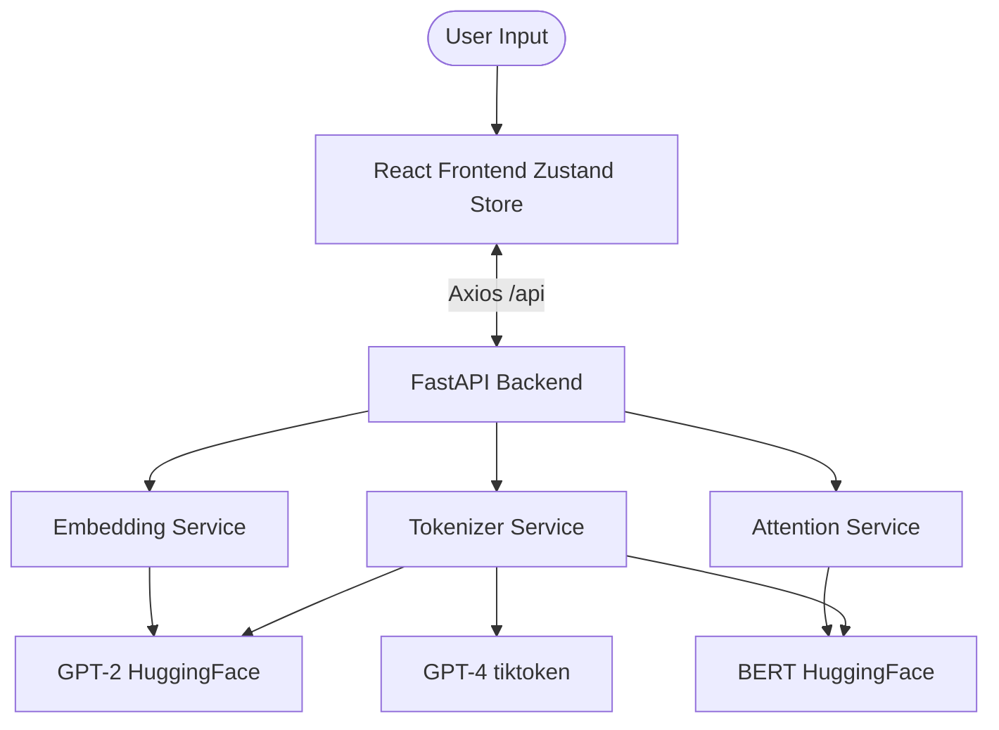

# Learn'N'Token 🚀

> **A "Kid-Friendly / Cyberpunk" LLM Tokenizer Visualizer.**
> Learn how AI "reads" by exploring 3D blocks, secret vault codes, and neural networks.

[](https://github.com/vamshikittu22/Learn-N-Token/actions)


---

## 🏗️ The "Kid-Friendly" Experience

Forget boring data tables. **Learn'N'Token** transforms complex NLP concepts into a digital playground:

- **🧩 LEGO Blocks**: Words are chopped into **interlocking 3D blocks**. Hover over a block to scan its metadata in a sci-fi hologram.
- **📡 The Brain Map**: A **Sci-Fi Radar Map** showing where words live in a 2D mathematical coordinate system. Watch common words cluster together like constellations.
- **🕸️ Neural Web**: Explore **Connecting Friends (Attention)** via a circular SVG graph where laser beams show which words "think" about each other.
- **🔋 Memory Batteries**: Track your context budget with **Liquid-Filled Battery Cells** that bubble and glow as the robot's "brain" gets full.
- **⚙️ Puzzle Forge**: Watch the **BPE Merging Game** in a forge animation where letters are hammered and fused into new subword pieces.
- **📟 Motherboard Chips**: See the **Secret Vault IDs** (raw integer sequence) as slotted hardware data chips on a cyberpunk motherboard.

---

## 🛠️ Features

- **Real Tokenization**: Uses genuine HuggingFace tokenizers (GPT-2, BERT) and OpenAI's `tiktoken` (GPT-4 / `cl100k_base`).
- **Pipeline Visualization**: A dynamic flowchart showing how **User Input** becomes **Tokens**, which then become **Secret IDs** and **Math Vectors**.
- **Comparison Mode**: Tokenize two different texts side-by-side to compare their token-per-word efficiency.
- **Robust API**: Fully typed FastAPI backend with Pydantic validation and lazy-loading for heavy NLP models.

---

## 🏗️ Architecture



Detailed technical breakdown is available in [ARCHITECTURE.md](./ARCHITECTURE.md).

---

## 🚀 Getting Started

You need Python 3.11+ and Node 18+ installed.

### Option A: Docker (Recommended)

1. Run `docker-compose up --build`.
2. UI: `http://localhost:5173/` | API: `http://localhost:8000/`

### Option B: Local Setup

#### 1. Backend (FastAPI)

```bash
cd backend
py -m venv venv
.\venv\Scripts\Activate.ps1   # Windows
pip install -r requirements.txt
uvicorn main:app --reload --port 8000
```

#### 2. Frontend (React + Vite)

```bash
cd frontend
npm install
npm run dev
```

---

## 📡 API Documentation

- `GET /health` - Health check.
- `POST /api/tokenize` - High-fidelity tokenization (includes 3D metadata).
- `POST /api/attention` - Retrieve real BERT Layer-6 attention matrices.
- `POST /api/compare` - Side-by-side efficiency comparison.

## 🤝 Contributing

1. Fork the feature branch.
2. Ensure you have the `ui-ux-pro-max` logic for any new visual components.
3. Open a Pull Request.

---

## 🗺️ Roadmap

- [ ] Standardizing Prompt Token Cost computations.
- [ ] Multi-layer attention head visualization.
- [ ] Interactive 3D vector space (Three.js integration).
